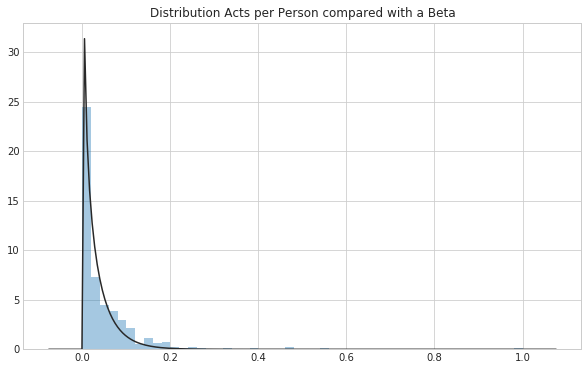
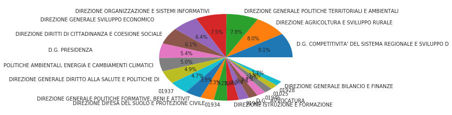

```python
import pandas as pd
import numpy as np

import matplotlib.pyplot as plt
plt.ioff()
import seaborn as sns
sns.set_style("whitegrid")
from scipy import stats, integrate
from scipy.stats import kendalltau

import warnings
warnings.filterwarnings('ignore')

# %matplotlib notebook

plt.rcParams['figure.figsize'] = (8, 8)
```


```python
def label_rotation(ax, angle):
    for tick in ax.get_xticklabels():
        tick.set_rotation(45)
    return ax
```


```python
df = pd.read_pickle('../data/atti-dirigenti.pkl')
df.shape
```


    (153206, 13)


```python
df.head(5)
```


<div>
<style scoped>
    .dataframe tbody tr th:only-of-type {
        vertical-align: middle;
    }

    .dataframe tbody tr th {
        vertical-align: top;
    }

    .dataframe thead th {
        text-align: right;
    }
</style>
<table border="1" class="dataframe">
  <thead>
    <tr style="text-align: right;">
      <th></th>
      <th>CODICE_PRATICA</th>
      <th>DATA_ATTO</th>
      <th>DESCRIZIONE_TIPO_PRATICA</th>
      <th>ID_TIPO</th>
      <th>ID_TIPO_PRATICA</th>
      <th>LINK_CONTENUTO_BINARIO</th>
      <th>OGGETTO</th>
      <th>PERSONA</th>
      <th>STATUS</th>
      <th>UFFICIO_AC</th>
      <th>UFFICIO_DG</th>
      <th>UFFICIO_SE</th>
      <th>DETAIL_URL</th>
    </tr>
  </thead>
  <tbody>
    <tr>
      <th>0</th>
      <td>20160140002016AD00000017201</td>
      <td>2016-12-19</td>
      <td>Atto dei dirigenti</td>
      <td>ADN</td>
      <td>MON</td>
      <td>http://www.regione.toscana.it/bancadati/atti/C...</td>
      <td>DGR 968/07 e s.m.i. Accreditamento degli organ...</td>
      <td>013910</td>
      <td>2</td>
      <td>00000</td>
      <td>50125</td>
      <td>05873</td>
      <td>http://www.regione.toscana.it/bancadati/atti/D...</td>
    </tr>
    <tr>
      <th>1</th>
      <td>20160140012016AD00000017466</td>
      <td>2016-12-21</td>
      <td>Atto dei dirigenti</td>
      <td>ADN</td>
      <td>MON</td>
      <td>http://www.regione.toscana.it/bancadati/atti/C...</td>
      <td>REG. CEE 2080/92 - AIUTI ALLE MISURE FORESTALI...</td>
      <td>005595</td>
      <td>2</td>
      <td>00000</td>
      <td>50117</td>
      <td>05015</td>
      <td>http://www.regione.toscana.it/bancadati/atti/D...</td>
    </tr>
    <tr>
      <th>2</th>
      <td>20160140022016AD00000017198</td>
      <td>2016-12-19</td>
      <td>Atto dei dirigenti</td>
      <td>ADN</td>
      <td>MON</td>
      <td>http://www.regione.toscana.it/bancadati/atti/C...</td>
      <td>Servizi autorizzati ex art.14 L.R. 42/98 "Norm...</td>
      <td>019075</td>
      <td>2</td>
      <td>00000</td>
      <td>50121</td>
      <td>04838</td>
      <td>http://www.regione.toscana.it/bancadati/atti/D...</td>
    </tr>
    <tr>
      <th>3</th>
      <td>20160140032016AD00000017208</td>
      <td>2016-12-19</td>
      <td>Atto dei dirigenti</td>
      <td>ADN</td>
      <td>MON</td>
      <td>http://www.regione.toscana.it/bancadati/atti/C...</td>
      <td>L.R. 1/2006, DCR 3/2012, L.R. 1/2015 art.29, c...</td>
      <td>020415</td>
      <td>2</td>
      <td>00000</td>
      <td>50117</td>
      <td>05018</td>
      <td>http://www.regione.toscana.it/bancadati/atti/D...</td>
    </tr>
    <tr>
      <th>4</th>
      <td>20160140042016AD00000017268</td>
      <td>2016-12-20</td>
      <td>Atto dei dirigenti</td>
      <td>ADN</td>
      <td>MON</td>
      <td>http://www.regione.toscana.it/bancadati/atti/C...</td>
      <td>L.R. n. 87/1997 - Pubblicazione sul BURT dell'...</td>
      <td>010826</td>
      <td>2</td>
      <td>00000</td>
      <td>50116</td>
      <td>05895</td>
      <td>http://www.regione.toscana.it/bancadati/atti/D...</td>
    </tr>
  </tbody>
</table>
</div>


Let us deescribe the features


```python
df.describe(include='all')
```


<div>
<style scoped>
    .dataframe tbody tr th:only-of-type {
        vertical-align: middle;
    }

    .dataframe tbody tr th {
        vertical-align: top;
    }

    .dataframe thead th {
        text-align: right;
    }
</style>
<table border="1" class="dataframe">
  <thead>
    <tr style="text-align: right;">
      <th></th>
      <th>CODICE_PRATICA</th>
      <th>DATA_ATTO</th>
      <th>DESCRIZIONE_TIPO_PRATICA</th>
      <th>ID_TIPO</th>
      <th>ID_TIPO_PRATICA</th>
      <th>LINK_CONTENUTO_BINARIO</th>
      <th>OGGETTO</th>
      <th>PERSONA</th>
      <th>STATUS</th>
      <th>UFFICIO_AC</th>
      <th>UFFICIO_DG</th>
      <th>UFFICIO_SE</th>
      <th>DETAIL_URL</th>
    </tr>
  </thead>
  <tbody>
    <tr>
      <th>count</th>
      <td>153206</td>
      <td>153206</td>
      <td>153206</td>
      <td>153206</td>
      <td>153206</td>
      <td>153206</td>
      <td>153206</td>
      <td>153206</td>
      <td>153206.000000</td>
      <td>153206</td>
      <td>153206</td>
      <td>153206</td>
      <td>153206</td>
    </tr>
    <tr>
      <th>unique</th>
      <td>152455</td>
      <td>4556</td>
      <td>1</td>
      <td>4</td>
      <td>1</td>
      <td>130730</td>
      <td>148031</td>
      <td>388</td>
      <td>NaN</td>
      <td>353</td>
      <td>43</td>
      <td>855</td>
      <td>152455</td>
    </tr>
    <tr>
      <th>top</th>
      <td>20020056002002AD00000006355</td>
      <td>2016-07-19 00:00:00</td>
      <td>Atto dei dirigenti</td>
      <td>AD</td>
      <td>MON</td>
      <td>http://www.regione.toscana.it/bancadati/atti/C...</td>
      <td>L.r. 55/2006 - "Interventi in favore delle vit...</td>
      <td>005549</td>
      <td>NaN</td>
      <td>00000</td>
      <td>50073</td>
      <td>0</td>
      <td>http://www.regione.toscana.it/bancadati/atti/D...</td>
    </tr>
    <tr>
      <th>freq</th>
      <td>2</td>
      <td>258</td>
      <td>153206</td>
      <td>62925</td>
      <td>153206</td>
      <td>21826</td>
      <td>417</td>
      <td>8022</td>
      <td>NaN</td>
      <td>44878</td>
      <td>13890</td>
      <td>29191</td>
      <td>2</td>
    </tr>
    <tr>
      <th>first</th>
      <td>NaN</td>
      <td>2000-01-04 00:00:00</td>
      <td>NaN</td>
      <td>NaN</td>
      <td>NaN</td>
      <td>NaN</td>
      <td>NaN</td>
      <td>NaN</td>
      <td>NaN</td>
      <td>NaN</td>
      <td>NaN</td>
      <td>NaN</td>
      <td>NaN</td>
    </tr>
    <tr>
      <th>last</th>
      <td>NaN</td>
      <td>2018-03-09 00:00:00</td>
      <td>NaN</td>
      <td>NaN</td>
      <td>NaN</td>
      <td>NaN</td>
      <td>NaN</td>
      <td>NaN</td>
      <td>NaN</td>
      <td>NaN</td>
      <td>NaN</td>
      <td>NaN</td>
      <td>NaN</td>
    </tr>
    <tr>
      <th>mean</th>
      <td>NaN</td>
      <td>NaN</td>
      <td>NaN</td>
      <td>NaN</td>
      <td>NaN</td>
      <td>NaN</td>
      <td>NaN</td>
      <td>NaN</td>
      <td>2.000509</td>
      <td>NaN</td>
      <td>NaN</td>
      <td>NaN</td>
      <td>NaN</td>
    </tr>
    <tr>
      <th>std</th>
      <td>NaN</td>
      <td>NaN</td>
      <td>NaN</td>
      <td>NaN</td>
      <td>NaN</td>
      <td>NaN</td>
      <td>NaN</td>
      <td>NaN</td>
      <td>0.140910</td>
      <td>NaN</td>
      <td>NaN</td>
      <td>NaN</td>
      <td>NaN</td>
    </tr>
    <tr>
      <th>min</th>
      <td>NaN</td>
      <td>NaN</td>
      <td>NaN</td>
      <td>NaN</td>
      <td>NaN</td>
      <td>NaN</td>
      <td>NaN</td>
      <td>NaN</td>
      <td>2.000000</td>
      <td>NaN</td>
      <td>NaN</td>
      <td>NaN</td>
      <td>NaN</td>
    </tr>
    <tr>
      <th>25%</th>
      <td>NaN</td>
      <td>NaN</td>
      <td>NaN</td>
      <td>NaN</td>
      <td>NaN</td>
      <td>NaN</td>
      <td>NaN</td>
      <td>NaN</td>
      <td>2.000000</td>
      <td>NaN</td>
      <td>NaN</td>
      <td>NaN</td>
      <td>NaN</td>
    </tr>
    <tr>
      <th>50%</th>
      <td>NaN</td>
      <td>NaN</td>
      <td>NaN</td>
      <td>NaN</td>
      <td>NaN</td>
      <td>NaN</td>
      <td>NaN</td>
      <td>NaN</td>
      <td>2.000000</td>
      <td>NaN</td>
      <td>NaN</td>
      <td>NaN</td>
      <td>NaN</td>
    </tr>
    <tr>
      <th>75%</th>
      <td>NaN</td>
      <td>NaN</td>
      <td>NaN</td>
      <td>NaN</td>
      <td>NaN</td>
      <td>NaN</td>
      <td>NaN</td>
      <td>NaN</td>
      <td>2.000000</td>
      <td>NaN</td>
      <td>NaN</td>
      <td>NaN</td>
      <td>NaN</td>
    </tr>
    <tr>
      <th>max</th>
      <td>NaN</td>
      <td>NaN</td>
      <td>NaN</td>
      <td>NaN</td>
      <td>NaN</td>
      <td>NaN</td>
      <td>NaN</td>
      <td>NaN</td>
      <td>41.000000</td>
      <td>NaN</td>
      <td>NaN</td>
      <td>NaN</td>
      <td>NaN</td>
    </tr>
  </tbody>
</table>
</div>


From the outcome of the describe we can notice that:
1. there are some duplicates by `CODICE_PRATICA`
2. the person 005549 occurs 8022 time as signer for acts while the most frequent office is 50073

As tasks:
- we are going to remove duplicates for `CODICE_PRATICA`

#### Drop duplicates by `CODICE_PRATICA`


```python
df_drop = df.drop_duplicates(subset=['CODICE_PRATICA'])
df = df_drop
```

### Replace office id with names

Let us merge the index with the name of the offices.


```python
df_office = pd.read_json('../data/strutture_processed.json')
df_office['ID'] = df_office['ID'].astype(str)
```


```python
id_office_map = df_office.set_index(df_office['ID']).drop(['ID'], axis=1).to_dict()['NOME']
```

We check what are the offices that do not have a match


```python
not_matched = []
matched = []
matched_id_name = {}

for i in df['UFFICIO_DG'].unique():
    if i in id_office_map:
        matched.append(id_office_map[i])
        matched_id_name[i] = id_office_map[i]
    else:
        not_matched.append(i)        
```

From the name of the offices it is interesting to see that there are:
- offices that changed the name 
- there are some abbreviations

we will create a replacement map to deal with these problems


```python
matched_id_name
```


    {'50125': 'DIREZIONE ISTRUZIONE E FORMAZIONE',
     '50117': 'DIREZIONE AGRICOLTURA E SVILUPPO RURALE',
     '50121': "DIREZIONE POLITICHE MOBILITA', INFRASTRUTTURE E TRASPORTO PUBBLICO LOCALE",
     '50116': 'DIREZIONE DIRITTI DI CITTADINANZA E COESIONE SOCIALE',
     '50123': "DIREZIONE ATTIVITA' PRODUTTIVE",
     '50118': 'DIREZIONE AMBIENTE ED ENERGIA',
     '50112': 'DIREZIONE GENERALE DIREZIONE GENERALE DELLA GIUNTA REGIONALE',
     '50119': 'DIREZIONE DIFESA DEL SUOLO E PROTEZIONE CIVILE',
     '50124': 'DIREZIONE CULTURA E RICERCA',
     '50115': 'DIREZIONE ORGANIZZAZIONE E SISTEMI INFORMATIVI',
     '50044': 'SEGRETERIE ORGANI POLITICI UFFICIO DI GABINETTO',
     '50007': 'D.G.  AVVOCATURA                                      ',
     '50127': 'DIREZIONE LAVORO',
     '50114': 'DIREZIONE PROGRAMMAZIONE E BILANCIO',
     '50122': 'DIREZIONE URBANISTICA, CASA E POLITICHE ABITATIVE',
     '50113': 'DIREZIONE AFFARI LEGISLATIVI, GIURIDICI ED ISTITUZIONALI',
     '50001': 'DIREZIONE GENERALE ORGANIZZAZIONE E SISTEMA INFORMATIV',
     '50004': 'DIREZIONE GENERALE POLITICHE TERRITORIALI E AMBIENTALI',
     '50002': 'DIREZIONE GENERALE BILANCIO E FINANZE                 ',
     '50003': 'DIREZIONE GENERALE SVILUPPO ECONOMICO                 ',
     '50005': 'DIREZIONE GENERALE DIRITTO ALLA SALUTE E POLITICHE DI ',
     '50000': 'D.G. PRESIDENZA                                       ',
     '50006': 'DIREZIONE GENERALE POLITICHE FORMATIVE, BENI E ATTIVIT',
     '50073': "D.G. COMPETITIVITA' DEL SISTEMA REGIONALE E SVILUPPO D",
     '50083': 'D.G. POLITICHE TERRITORIALI, AMBIENTALI E PER LA MOBIL',
     '50079': 'D.G. DIRITTI DI CITTADINANZA E COESIONE SOCIALE       ',
     '50102': 'D.G. ORGANIZZAZIONE                                   ',
     '50069': 'D.G. ORGANIZZAZIONE E RISORSE                         ',
     '99999': 'ALTRI UFFICI',
     '50201': "DIREZIONE GENERALE POLITICHE MOBILITA', INFRASTRUTTURE E TRASPORTO PUBBLICO LOCALE",
     '50202': 'POLITICHE AMBIENTALI, ENERGIA E CAMBIAMENTI CLIMATICI',
     '50200': 'DIREZIONE GENERALE GOVERNO DEL TERRITORIO',
     '50026': 'DIREZIONE GENERALE SEGRETERIE ORGANI POLITICI DELLA GIUNTA'}


```python
to_replace = {
    '50001': '50115',
    '50069': '50115',
    '50102': '50115',
    '50083': '50004',
    '50079': '50116',
    '50118': '50202',
    '50121': '50201'
}
```

- We can replace the offices with wrong names
- we reaplace the codes with the canonical names of the offices


```python
df_replaced = df
df_replaced['UFFICIO_DG'] = df['UFFICIO_DG'].replace(to_replace)
```


```python
df= df_replaced.replace(matched_id_name)
```


```python
df.head()
```


<div>
<style scoped>
    .dataframe tbody tr th:only-of-type {
        vertical-align: middle;
    }

    .dataframe tbody tr th {
        vertical-align: top;
    }

    .dataframe thead th {
        text-align: right;
    }
</style>
<table border="1" class="dataframe">
  <thead>
    <tr style="text-align: right;">
      <th></th>
      <th>CODICE_PRATICA</th>
      <th>DATA_ATTO</th>
      <th>DESCRIZIONE_TIPO_PRATICA</th>
      <th>ID_TIPO</th>
      <th>ID_TIPO_PRATICA</th>
      <th>LINK_CONTENUTO_BINARIO</th>
      <th>OGGETTO</th>
      <th>PERSONA</th>
      <th>STATUS</th>
      <th>UFFICIO_AC</th>
      <th>UFFICIO_DG</th>
      <th>UFFICIO_SE</th>
      <th>DETAIL_URL</th>
    </tr>
  </thead>
  <tbody>
    <tr>
      <th>0</th>
      <td>20160140002016AD00000017201</td>
      <td>2016-12-19</td>
      <td>Atto dei dirigenti</td>
      <td>ADN</td>
      <td>MON</td>
      <td>http://www.regione.toscana.it/bancadati/atti/C...</td>
      <td>DGR 968/07 e s.m.i. Accreditamento degli organ...</td>
      <td>013910</td>
      <td>2</td>
      <td>00000</td>
      <td>DIREZIONE ISTRUZIONE E FORMAZIONE</td>
      <td>05873</td>
      <td>http://www.regione.toscana.it/bancadati/atti/D...</td>
    </tr>
    <tr>
      <th>1</th>
      <td>20160140012016AD00000017466</td>
      <td>2016-12-21</td>
      <td>Atto dei dirigenti</td>
      <td>ADN</td>
      <td>MON</td>
      <td>http://www.regione.toscana.it/bancadati/atti/C...</td>
      <td>REG. CEE 2080/92 - AIUTI ALLE MISURE FORESTALI...</td>
      <td>005595</td>
      <td>2</td>
      <td>00000</td>
      <td>DIREZIONE AGRICOLTURA E SVILUPPO RURALE</td>
      <td>05015</td>
      <td>http://www.regione.toscana.it/bancadati/atti/D...</td>
    </tr>
    <tr>
      <th>2</th>
      <td>20160140022016AD00000017198</td>
      <td>2016-12-19</td>
      <td>Atto dei dirigenti</td>
      <td>ADN</td>
      <td>MON</td>
      <td>http://www.regione.toscana.it/bancadati/atti/C...</td>
      <td>Servizi autorizzati ex art.14 L.R. 42/98 "Norm...</td>
      <td>019075</td>
      <td>2</td>
      <td>00000</td>
      <td>DIREZIONE GENERALE POLITICHE MOBILITA', INFRAS...</td>
      <td>04838</td>
      <td>http://www.regione.toscana.it/bancadati/atti/D...</td>
    </tr>
    <tr>
      <th>3</th>
      <td>20160140032016AD00000017208</td>
      <td>2016-12-19</td>
      <td>Atto dei dirigenti</td>
      <td>ADN</td>
      <td>MON</td>
      <td>http://www.regione.toscana.it/bancadati/atti/C...</td>
      <td>L.R. 1/2006, DCR 3/2012, L.R. 1/2015 art.29, c...</td>
      <td>020415</td>
      <td>2</td>
      <td>00000</td>
      <td>DIREZIONE AGRICOLTURA E SVILUPPO RURALE</td>
      <td>05018</td>
      <td>http://www.regione.toscana.it/bancadati/atti/D...</td>
    </tr>
    <tr>
      <th>4</th>
      <td>20160140042016AD00000017268</td>
      <td>2016-12-20</td>
      <td>Atto dei dirigenti</td>
      <td>ADN</td>
      <td>MON</td>
      <td>http://www.regione.toscana.it/bancadati/atti/C...</td>
      <td>L.R. n. 87/1997 - Pubblicazione sul BURT dell'...</td>
      <td>010826</td>
      <td>2</td>
      <td>00000</td>
      <td>DIREZIONE DIRITTI DI CITTADINANZA E COESIONE S...</td>
      <td>05895</td>
      <td>http://www.regione.toscana.it/bancadati/atti/D...</td>
    </tr>
  </tbody>
</table>
</div>


## Data Exploration

As first step we want visualize the distrubition of the acts per:
- year
- employee
- office
    
### Acts Per Year


```python
acts_per_year = df.groupby([df['DATA_ATTO'].dt.year])['CODICE_PRATICA'].count()

fig, ax = plt.subplots()
sns.barplot(acts_per_year.index, acts_per_year.values, palette="BuGn_d", ax=ax)
label_rotation(ax, 45)
fig.set_size_inches(10,6)
plt.title('Distribution Acts per Year')
plt.show(fig)
```


The distribution of the acts per year shows that there is an increase of acts for the years 2016 and 2017.
This is because in 2016 there was a grouping of the regional districts.

From another point of view is interesting to see the distribution of acts per person.

### Acts Per Employee


```python
print('acts distribution per person')
acts_per_person = df.groupby([df['PERSONA']])['CODICE_PRATICA'].count().sort_values(ascending=False)
print(acts_per_person[:10])
```

    acts distribution per person
    PERSONA
    005549    7989
    020411    4316
    005045    3816
    015534    3778
    007505    3060
    014002    2645
    013692    2103
    005642    2013
    005070    1943
    017792    1836
    Name: CODICE_PRATICA, dtype: int64


We scale the values in the range [0:1] to make the visualization more clear and plot the distribution.


```python
acts_per_person_scaled = (acts_per_person - acts_per_person.min()) / (acts_per_person.max() - acts_per_person.min())

fig, ax = plt.subplots()
sns.distplot(acts_per_person_scaled.values, kde=False, ax=ax, fit=stats.beta)
fig.set_size_inches(10,6)
plt.title('Distribution Acts per Person compared with a Beta')
plt.show()
```





Here we can see that the distribution follows a beta distribution, which means that there is a 

### Distribution of Acts per Office

from here we can see what are the most active offices


```python
df_act_office = df.groupby(df['UFFICIO_DG'])['CODICE_PRATICA'].count()
df_act_office /= df_act_office.max()
top = df_act_office.sort_values(ascending=False)[:20]
plt.pie(top, labels=top.index, autopct='%1.1f%%')
plt.show()
```





### Acts per Offices and per Year

Since the data range from 2001 to 2018 there are several office which are closed or merged with others.
Let see what are:
- the offices active in the last 2 years
- the offices not active


```python
group_office_year = df.groupby(by=[df['UFFICIO_DG'], df['DATA_ATTO'].dt.year])['CODICE_PRATICA'].count()
```

If we unstack the grouped data we can see what are the years of activity of the offices.


```python
df_office_year = group_office_year.unstack()
df_office_year
```


<div>
<style scoped>
    .dataframe tbody tr th:only-of-type {
        vertical-align: middle;
    }

    .dataframe tbody tr th {
        vertical-align: top;
    }

    .dataframe thead th {
        text-align: right;
    }
</style>
<table border="1" class="dataframe">
  <thead>
    <tr style="text-align: right;">
      <th>DATA_ATTO</th>
      <th>2000</th>
      <th>2001</th>
      <th>2002</th>
      <th>2003</th>
      <th>2004</th>
      <th>2005</th>
      <th>2006</th>
      <th>2007</th>
      <th>2008</th>
      <th>2009</th>
      <th>2010</th>
      <th>2011</th>
      <th>2012</th>
      <th>2013</th>
      <th>2014</th>
      <th>2015</th>
      <th>2016</th>
      <th>2017</th>
      <th>2018</th>
    </tr>
    <tr>
      <th>UFFICIO_DG</th>
      <th></th>
      <th></th>
      <th></th>
      <th></th>
      <th></th>
      <th></th>
      <th></th>
      <th></th>
      <th></th>
      <th></th>
      <th></th>
      <th></th>
      <th></th>
      <th></th>
      <th></th>
      <th></th>
      <th></th>
      <th></th>
      <th></th>
    </tr>
  </thead>
  <tbody>
    <tr>
      <th>01025</th>
      <td>NaN</td>
      <td>1083.0</td>
      <td>884.0</td>
      <td>1063.0</td>
      <td>NaN</td>
      <td>NaN</td>
      <td>NaN</td>
      <td>NaN</td>
      <td>NaN</td>
      <td>NaN</td>
      <td>NaN</td>
      <td>NaN</td>
      <td>NaN</td>
      <td>NaN</td>
      <td>NaN</td>
      <td>NaN</td>
      <td>NaN</td>
      <td>NaN</td>
      <td>NaN</td>
    </tr>
    <tr>
      <th>01027</th>
      <td>NaN</td>
      <td>472.0</td>
      <td>505.0</td>
      <td>467.0</td>
      <td>NaN</td>
      <td>NaN</td>
      <td>NaN</td>
      <td>NaN</td>
      <td>NaN</td>
      <td>NaN</td>
      <td>NaN</td>
      <td>NaN</td>
      <td>NaN</td>
      <td>NaN</td>
      <td>NaN</td>
      <td>NaN</td>
      <td>NaN</td>
      <td>NaN</td>
      <td>NaN</td>
    </tr>
    <tr>
      <th>01923</th>
      <td>241.0</td>
      <td>264.0</td>
      <td>320.0</td>
      <td>260.0</td>
      <td>NaN</td>
      <td>NaN</td>
      <td>NaN</td>
      <td>NaN</td>
      <td>NaN</td>
      <td>NaN</td>
      <td>NaN</td>
      <td>NaN</td>
      <td>NaN</td>
      <td>NaN</td>
      <td>NaN</td>
      <td>NaN</td>
      <td>NaN</td>
      <td>NaN</td>
      <td>NaN</td>
    </tr>
    <tr>
      <th>01928</th>
      <td>711.0</td>
      <td>666.0</td>
      <td>697.0</td>
      <td>636.0</td>
      <td>NaN</td>
      <td>NaN</td>
      <td>NaN</td>
      <td>NaN</td>
      <td>NaN</td>
      <td>NaN</td>
      <td>NaN</td>
      <td>NaN</td>
      <td>NaN</td>
      <td>NaN</td>
      <td>NaN</td>
      <td>NaN</td>
      <td>NaN</td>
      <td>NaN</td>
      <td>NaN</td>
    </tr>
    <tr>
      <th>01931</th>
      <td>1582.0</td>
      <td>NaN</td>
      <td>NaN</td>
      <td>NaN</td>
      <td>NaN</td>
      <td>NaN</td>
      <td>NaN</td>
      <td>NaN</td>
      <td>NaN</td>
      <td>NaN</td>
      <td>NaN</td>
      <td>NaN</td>
      <td>NaN</td>
      <td>NaN</td>
      <td>NaN</td>
      <td>NaN</td>
      <td>NaN</td>
      <td>NaN</td>
      <td>NaN</td>
    </tr>
    <tr>
      <th>01934</th>
      <td>1346.0</td>
      <td>1168.0</td>
      <td>1126.0</td>
      <td>1283.0</td>
      <td>NaN</td>
      <td>NaN</td>
      <td>NaN</td>
      <td>NaN</td>
      <td>NaN</td>
      <td>NaN</td>
      <td>NaN</td>
      <td>NaN</td>
      <td>NaN</td>
      <td>NaN</td>
      <td>NaN</td>
      <td>NaN</td>
      <td>NaN</td>
      <td>NaN</td>
      <td>NaN</td>
    </tr>
    <tr>
      <th>01937</th>
      <td>1638.0</td>
      <td>1654.0</td>
      <td>1723.0</td>
      <td>2143.0</td>
      <td>2.0</td>
      <td>NaN</td>
      <td>NaN</td>
      <td>NaN</td>
      <td>NaN</td>
      <td>NaN</td>
      <td>NaN</td>
      <td>NaN</td>
      <td>NaN</td>
      <td>NaN</td>
      <td>NaN</td>
      <td>NaN</td>
      <td>NaN</td>
      <td>NaN</td>
      <td>NaN</td>
    </tr>
    <tr>
      <th>01943</th>
      <td>860.0</td>
      <td>942.0</td>
      <td>894.0</td>
      <td>1137.0</td>
      <td>NaN</td>
      <td>NaN</td>
      <td>NaN</td>
      <td>NaN</td>
      <td>NaN</td>
      <td>NaN</td>
      <td>NaN</td>
      <td>NaN</td>
      <td>NaN</td>
      <td>NaN</td>
      <td>NaN</td>
      <td>NaN</td>
      <td>NaN</td>
      <td>NaN</td>
      <td>NaN</td>
    </tr>
    <tr>
      <th>01946</th>
      <td>638.0</td>
      <td>849.0</td>
      <td>918.0</td>
      <td>941.0</td>
      <td>1.0</td>
      <td>NaN</td>
      <td>NaN</td>
      <td>NaN</td>
      <td>NaN</td>
      <td>NaN</td>
      <td>NaN</td>
      <td>NaN</td>
      <td>NaN</td>
      <td>NaN</td>
      <td>NaN</td>
      <td>NaN</td>
      <td>NaN</td>
      <td>NaN</td>
      <td>NaN</td>
    </tr>
    <tr>
      <th>02090</th>
      <td>622.0</td>
      <td>431.0</td>
      <td>296.0</td>
      <td>215.0</td>
      <td>NaN</td>
      <td>NaN</td>
      <td>NaN</td>
      <td>NaN</td>
      <td>NaN</td>
      <td>NaN</td>
      <td>NaN</td>
      <td>NaN</td>
      <td>NaN</td>
      <td>NaN</td>
      <td>NaN</td>
      <td>NaN</td>
      <td>NaN</td>
      <td>NaN</td>
      <td>NaN</td>
    </tr>
    <tr>
      <th>ALTRI UFFICI</th>
      <td>148.0</td>
      <td>198.0</td>
      <td>206.0</td>
      <td>207.0</td>
      <td>NaN</td>
      <td>NaN</td>
      <td>NaN</td>
      <td>NaN</td>
      <td>NaN</td>
      <td>30.0</td>
      <td>NaN</td>
      <td>1.0</td>
      <td>NaN</td>
      <td>NaN</td>
      <td>NaN</td>
      <td>NaN</td>
      <td>NaN</td>
      <td>NaN</td>
      <td>NaN</td>
    </tr>
    <tr>
      <th>D.G.  AVVOCATURA</th>
      <td>NaN</td>
      <td>NaN</td>
      <td>NaN</td>
      <td>NaN</td>
      <td>267.0</td>
      <td>268.0</td>
      <td>226.0</td>
      <td>240.0</td>
      <td>221.0</td>
      <td>217.0</td>
      <td>208.0</td>
      <td>210.0</td>
      <td>202.0</td>
      <td>169.0</td>
      <td>201.0</td>
      <td>285.0</td>
      <td>254.0</td>
      <td>357.0</td>
      <td>53.0</td>
    </tr>
    <tr>
      <th>D.G. COMPETITIVITA' DEL SISTEMA REGIONALE E SVILUPPO D</th>
      <td>NaN</td>
      <td>NaN</td>
      <td>NaN</td>
      <td>NaN</td>
      <td>NaN</td>
      <td>NaN</td>
      <td>NaN</td>
      <td>NaN</td>
      <td>NaN</td>
      <td>NaN</td>
      <td>1104.0</td>
      <td>2594.0</td>
      <td>2693.0</td>
      <td>2728.0</td>
      <td>3019.0</td>
      <td>1688.0</td>
      <td>NaN</td>
      <td>NaN</td>
      <td>NaN</td>
    </tr>
    <tr>
      <th>D.G. PRESIDENZA</th>
      <td>NaN</td>
      <td>NaN</td>
      <td>NaN</td>
      <td>NaN</td>
      <td>878.0</td>
      <td>722.0</td>
      <td>702.0</td>
      <td>676.0</td>
      <td>708.0</td>
      <td>772.0</td>
      <td>782.0</td>
      <td>700.0</td>
      <td>747.0</td>
      <td>652.0</td>
      <td>621.0</td>
      <td>330.0</td>
      <td>NaN</td>
      <td>NaN</td>
      <td>NaN</td>
    </tr>
    <tr>
      <th>DIREZIONE AFFARI LEGISLATIVI, GIURIDICI ED ISTITUZIONALI</th>
      <td>NaN</td>
      <td>NaN</td>
      <td>NaN</td>
      <td>NaN</td>
      <td>NaN</td>
      <td>NaN</td>
      <td>NaN</td>
      <td>NaN</td>
      <td>NaN</td>
      <td>NaN</td>
      <td>NaN</td>
      <td>NaN</td>
      <td>NaN</td>
      <td>NaN</td>
      <td>NaN</td>
      <td>53.0</td>
      <td>142.0</td>
      <td>132.0</td>
      <td>24.0</td>
    </tr>
    <tr>
      <th>DIREZIONE AGRICOLTURA E SVILUPPO RURALE</th>
      <td>NaN</td>
      <td>NaN</td>
      <td>NaN</td>
      <td>NaN</td>
      <td>NaN</td>
      <td>NaN</td>
      <td>NaN</td>
      <td>NaN</td>
      <td>NaN</td>
      <td>NaN</td>
      <td>NaN</td>
      <td>NaN</td>
      <td>NaN</td>
      <td>NaN</td>
      <td>NaN</td>
      <td>358.0</td>
      <td>4325.0</td>
      <td>6388.0</td>
      <td>1157.0</td>
    </tr>
    <tr>
      <th>DIREZIONE ATTIVITA' PRODUTTIVE</th>
      <td>NaN</td>
      <td>NaN</td>
      <td>NaN</td>
      <td>NaN</td>
      <td>NaN</td>
      <td>NaN</td>
      <td>NaN</td>
      <td>NaN</td>
      <td>NaN</td>
      <td>NaN</td>
      <td>NaN</td>
      <td>NaN</td>
      <td>NaN</td>
      <td>NaN</td>
      <td>NaN</td>
      <td>287.0</td>
      <td>567.0</td>
      <td>753.0</td>
      <td>117.0</td>
    </tr>
    <tr>
      <th>DIREZIONE CULTURA E RICERCA</th>
      <td>NaN</td>
      <td>NaN</td>
      <td>NaN</td>
      <td>NaN</td>
      <td>NaN</td>
      <td>NaN</td>
      <td>NaN</td>
      <td>NaN</td>
      <td>NaN</td>
      <td>NaN</td>
      <td>NaN</td>
      <td>NaN</td>
      <td>NaN</td>
      <td>NaN</td>
      <td>NaN</td>
      <td>141.0</td>
      <td>277.0</td>
      <td>262.0</td>
      <td>23.0</td>
    </tr>
    <tr>
      <th>DIREZIONE DIFESA DEL SUOLO E PROTEZIONE CIVILE</th>
      <td>NaN</td>
      <td>NaN</td>
      <td>NaN</td>
      <td>NaN</td>
      <td>NaN</td>
      <td>NaN</td>
      <td>NaN</td>
      <td>NaN</td>
      <td>NaN</td>
      <td>NaN</td>
      <td>NaN</td>
      <td>NaN</td>
      <td>NaN</td>
      <td>NaN</td>
      <td>NaN</td>
      <td>112.0</td>
      <td>1619.0</td>
      <td>2812.0</td>
      <td>516.0</td>
    </tr>
    <tr>
      <th>DIREZIONE DIRITTI DI CITTADINANZA E COESIONE SOCIALE</th>
      <td>NaN</td>
      <td>NaN</td>
      <td>NaN</td>
      <td>NaN</td>
      <td>NaN</td>
      <td>NaN</td>
      <td>NaN</td>
      <td>NaN</td>
      <td>NaN</td>
      <td>NaN</td>
      <td>567.0</td>
      <td>1229.0</td>
      <td>1367.0</td>
      <td>1090.0</td>
      <td>1134.0</td>
      <td>1362.0</td>
      <td>1236.0</td>
      <td>1156.0</td>
      <td>137.0</td>
    </tr>
    <tr>
      <th>DIREZIONE GENERALE BILANCIO E FINANZE</th>
      <td>NaN</td>
      <td>NaN</td>
      <td>NaN</td>
      <td>NaN</td>
      <td>400.0</td>
      <td>422.0</td>
      <td>365.0</td>
      <td>406.0</td>
      <td>421.0</td>
      <td>386.0</td>
      <td>224.0</td>
      <td>NaN</td>
      <td>NaN</td>
      <td>NaN</td>
      <td>NaN</td>
      <td>NaN</td>
      <td>NaN</td>
      <td>NaN</td>
      <td>NaN</td>
    </tr>
    <tr>
      <th>DIREZIONE GENERALE DIREZIONE GENERALE DELLA GIUNTA REGIONALE</th>
      <td>NaN</td>
      <td>NaN</td>
      <td>NaN</td>
      <td>NaN</td>
      <td>NaN</td>
      <td>NaN</td>
      <td>NaN</td>
      <td>NaN</td>
      <td>NaN</td>
      <td>NaN</td>
      <td>NaN</td>
      <td>NaN</td>
      <td>NaN</td>
      <td>NaN</td>
      <td>NaN</td>
      <td>131.0</td>
      <td>313.0</td>
      <td>258.0</td>
      <td>40.0</td>
    </tr>
    <tr>
      <th>DIREZIONE GENERALE DIRITTO ALLA SALUTE E POLITICHE DI</th>
      <td>NaN</td>
      <td>NaN</td>
      <td>NaN</td>
      <td>NaN</td>
      <td>1199.0</td>
      <td>1197.0</td>
      <td>1038.0</td>
      <td>1076.0</td>
      <td>1082.0</td>
      <td>1283.0</td>
      <td>604.0</td>
      <td>NaN</td>
      <td>NaN</td>
      <td>NaN</td>
      <td>NaN</td>
      <td>NaN</td>
      <td>NaN</td>
      <td>NaN</td>
      <td>NaN</td>
    </tr>
    <tr>
      <th>DIREZIONE GENERALE GOVERNO DEL TERRITORIO</th>
      <td>NaN</td>
      <td>NaN</td>
      <td>NaN</td>
      <td>NaN</td>
      <td>NaN</td>
      <td>NaN</td>
      <td>NaN</td>
      <td>NaN</td>
      <td>NaN</td>
      <td>NaN</td>
      <td>NaN</td>
      <td>NaN</td>
      <td>NaN</td>
      <td>48.0</td>
      <td>50.0</td>
      <td>18.0</td>
      <td>NaN</td>
      <td>NaN</td>
      <td>NaN</td>
    </tr>
    <tr>
      <th>DIREZIONE GENERALE POLITICHE FORMATIVE, BENI E ATTIVIT</th>
      <td>NaN</td>
      <td>NaN</td>
      <td>NaN</td>
      <td>NaN</td>
      <td>979.0</td>
      <td>877.0</td>
      <td>828.0</td>
      <td>861.0</td>
      <td>872.0</td>
      <td>1035.0</td>
      <td>569.0</td>
      <td>NaN</td>
      <td>NaN</td>
      <td>NaN</td>
      <td>NaN</td>
      <td>NaN</td>
      <td>NaN</td>
      <td>NaN</td>
      <td>NaN</td>
    </tr>
    <tr>
      <th>DIREZIONE GENERALE POLITICHE MOBILITA', INFRASTRUTTURE E TRASPORTO PUBBLICO LOCALE</th>
      <td>NaN</td>
      <td>NaN</td>
      <td>NaN</td>
      <td>NaN</td>
      <td>NaN</td>
      <td>NaN</td>
      <td>NaN</td>
      <td>NaN</td>
      <td>NaN</td>
      <td>NaN</td>
      <td>NaN</td>
      <td>NaN</td>
      <td>NaN</td>
      <td>224.0</td>
      <td>276.0</td>
      <td>306.0</td>
      <td>347.0</td>
      <td>396.0</td>
      <td>47.0</td>
    </tr>
    <tr>
      <th>DIREZIONE GENERALE POLITICHE TERRITORIALI E AMBIENTALI</th>
      <td>NaN</td>
      <td>NaN</td>
      <td>NaN</td>
      <td>NaN</td>
      <td>2076.0</td>
      <td>1808.0</td>
      <td>1390.0</td>
      <td>1292.0</td>
      <td>1248.0</td>
      <td>1290.0</td>
      <td>990.0</td>
      <td>832.0</td>
      <td>762.0</td>
      <td>132.0</td>
      <td>NaN</td>
      <td>NaN</td>
      <td>NaN</td>
      <td>NaN</td>
      <td>NaN</td>
    </tr>
    <tr>
      <th>DIREZIONE GENERALE SEGRETERIE ORGANI POLITICI DELLA GIUNTA</th>
      <td>NaN</td>
      <td>NaN</td>
      <td>NaN</td>
      <td>NaN</td>
      <td>NaN</td>
      <td>NaN</td>
      <td>NaN</td>
      <td>NaN</td>
      <td>NaN</td>
      <td>NaN</td>
      <td>NaN</td>
      <td>NaN</td>
      <td>NaN</td>
      <td>71.0</td>
      <td>34.0</td>
      <td>NaN</td>
      <td>NaN</td>
      <td>NaN</td>
      <td>NaN</td>
    </tr>
    <tr>
      <th>DIREZIONE GENERALE SVILUPPO ECONOMICO</th>
      <td>NaN</td>
      <td>NaN</td>
      <td>NaN</td>
      <td>NaN</td>
      <td>1501.0</td>
      <td>1397.0</td>
      <td>1500.0</td>
      <td>1466.0</td>
      <td>1443.0</td>
      <td>1601.0</td>
      <td>816.0</td>
      <td>NaN</td>
      <td>NaN</td>
      <td>NaN</td>
      <td>NaN</td>
      <td>NaN</td>
      <td>NaN</td>
      <td>NaN</td>
      <td>NaN</td>
    </tr>
    <tr>
      <th>DIREZIONE ISTRUZIONE E FORMAZIONE</th>
      <td>NaN</td>
      <td>NaN</td>
      <td>NaN</td>
      <td>NaN</td>
      <td>NaN</td>
      <td>NaN</td>
      <td>NaN</td>
      <td>NaN</td>
      <td>NaN</td>
      <td>NaN</td>
      <td>NaN</td>
      <td>NaN</td>
      <td>NaN</td>
      <td>NaN</td>
      <td>NaN</td>
      <td>420.0</td>
      <td>1728.0</td>
      <td>1838.0</td>
      <td>270.0</td>
    </tr>
    <tr>
      <th>DIREZIONE LAVORO</th>
      <td>NaN</td>
      <td>NaN</td>
      <td>NaN</td>
      <td>NaN</td>
      <td>NaN</td>
      <td>NaN</td>
      <td>NaN</td>
      <td>NaN</td>
      <td>NaN</td>
      <td>NaN</td>
      <td>NaN</td>
      <td>NaN</td>
      <td>NaN</td>
      <td>NaN</td>
      <td>NaN</td>
      <td>NaN</td>
      <td>639.0</td>
      <td>542.0</td>
      <td>114.0</td>
    </tr>
    <tr>
      <th>DIREZIONE ORGANIZZAZIONE E SISTEMI INFORMATIVI</th>
      <td>NaN</td>
      <td>NaN</td>
      <td>NaN</td>
      <td>NaN</td>
      <td>1179.0</td>
      <td>954.0</td>
      <td>765.0</td>
      <td>879.0</td>
      <td>871.0</td>
      <td>700.0</td>
      <td>889.0</td>
      <td>947.0</td>
      <td>754.0</td>
      <td>638.0</td>
      <td>656.0</td>
      <td>611.0</td>
      <td>751.0</td>
      <td>751.0</td>
      <td>99.0</td>
    </tr>
    <tr>
      <th>DIREZIONE PROGRAMMAZIONE E BILANCIO</th>
      <td>NaN</td>
      <td>NaN</td>
      <td>NaN</td>
      <td>NaN</td>
      <td>NaN</td>
      <td>NaN</td>
      <td>NaN</td>
      <td>NaN</td>
      <td>NaN</td>
      <td>NaN</td>
      <td>NaN</td>
      <td>NaN</td>
      <td>NaN</td>
      <td>NaN</td>
      <td>NaN</td>
      <td>79.0</td>
      <td>163.0</td>
      <td>160.0</td>
      <td>24.0</td>
    </tr>
    <tr>
      <th>DIREZIONE URBANISTICA, CASA E POLITICHE ABITATIVE</th>
      <td>NaN</td>
      <td>NaN</td>
      <td>NaN</td>
      <td>NaN</td>
      <td>NaN</td>
      <td>NaN</td>
      <td>NaN</td>
      <td>NaN</td>
      <td>NaN</td>
      <td>NaN</td>
      <td>NaN</td>
      <td>NaN</td>
      <td>NaN</td>
      <td>NaN</td>
      <td>NaN</td>
      <td>104.0</td>
      <td>186.0</td>
      <td>139.0</td>
      <td>18.0</td>
    </tr>
    <tr>
      <th>POLITICHE AMBIENTALI, ENERGIA E CAMBIAMENTI CLIMATICI</th>
      <td>NaN</td>
      <td>NaN</td>
      <td>NaN</td>
      <td>NaN</td>
      <td>NaN</td>
      <td>NaN</td>
      <td>NaN</td>
      <td>NaN</td>
      <td>NaN</td>
      <td>NaN</td>
      <td>NaN</td>
      <td>NaN</td>
      <td>NaN</td>
      <td>336.0</td>
      <td>656.0</td>
      <td>379.0</td>
      <td>2384.0</td>
      <td>3409.0</td>
      <td>449.0</td>
    </tr>
    <tr>
      <th>SEGRETERIE ORGANI POLITICI UFFICIO DI GABINETTO</th>
      <td>NaN</td>
      <td>NaN</td>
      <td>NaN</td>
      <td>NaN</td>
      <td>NaN</td>
      <td>NaN</td>
      <td>NaN</td>
      <td>NaN</td>
      <td>NaN</td>
      <td>NaN</td>
      <td>NaN</td>
      <td>NaN</td>
      <td>NaN</td>
      <td>3.0</td>
      <td>50.0</td>
      <td>89.0</td>
      <td>126.0</td>
      <td>156.0</td>
      <td>18.0</td>
    </tr>
  </tbody>
</table>
</div>


### Replace office id with names

Let us merge the index with the name of the offices.


```python
df_office = pd.read_json('../data/strutture_processed.json')
df_office['ID'] = df_office['ID'].astype(str)
```


```python
id_office_map = df_office.set_index(df_office['ID']).drop(['ID'], axis=1).to_dict()['NOME']
```

We check what are the offices that do not have a match


```python
not_matched = []
matched = []
matched_id_name = {}

for i in df_office_year.index:
    if i in id_office_map:
        matched.append(id_office_map[i])
        matched_id_name[i] = id_office_map[i]
    else:
        not_matched.append(i)        
```

From the name of the offices it is interesting to see that there are:
- offices that changed the name 
- there are some abbreviations

we will create a replacement map to deal with these problems


```python
matched_id_name
```


    {}


```python
to_replace = {
    '50001': '50115',
    '50069': '50115',
    '50102': '50115',
    '50083': '50004',
    '50079': '50116',
    '50118': '50202',
    '50121': '50201'
}
```

- We can replace the offices with wrong names
- we reaplace the codes with the canonical names of the offices


```python
df_replaced = df
df_replaced['UFFICIO_DG'] = df['UFFICIO_DG'].replace(to_replace)
```


```python
df= df_replaced.replace(matched_id_name)
```


```python
df.head()
```


<div>
<style scoped>
    .dataframe tbody tr th:only-of-type {
        vertical-align: middle;
    }

    .dataframe tbody tr th {
        vertical-align: top;
    }

    .dataframe thead th {
        text-align: right;
    }
</style>
<table border="1" class="dataframe">
  <thead>
    <tr style="text-align: right;">
      <th></th>
      <th>CODICE_PRATICA</th>
      <th>DATA_ATTO</th>
      <th>DESCRIZIONE_TIPO_PRATICA</th>
      <th>ID_TIPO</th>
      <th>ID_TIPO_PRATICA</th>
      <th>LINK_CONTENUTO_BINARIO</th>
      <th>OGGETTO</th>
      <th>PERSONA</th>
      <th>STATUS</th>
      <th>UFFICIO_AC</th>
      <th>UFFICIO_DG</th>
      <th>UFFICIO_SE</th>
      <th>DETAIL_URL</th>
    </tr>
  </thead>
  <tbody>
    <tr>
      <th>0</th>
      <td>20160140002016AD00000017201</td>
      <td>2016-12-19</td>
      <td>Atto dei dirigenti</td>
      <td>ADN</td>
      <td>MON</td>
      <td>http://www.regione.toscana.it/bancadati/atti/C...</td>
      <td>DGR 968/07 e s.m.i. Accreditamento degli organ...</td>
      <td>013910</td>
      <td>2</td>
      <td>00000</td>
      <td>DIREZIONE ISTRUZIONE E FORMAZIONE</td>
      <td>05873</td>
      <td>http://www.regione.toscana.it/bancadati/atti/D...</td>
    </tr>
    <tr>
      <th>1</th>
      <td>20160140012016AD00000017466</td>
      <td>2016-12-21</td>
      <td>Atto dei dirigenti</td>
      <td>ADN</td>
      <td>MON</td>
      <td>http://www.regione.toscana.it/bancadati/atti/C...</td>
      <td>REG. CEE 2080/92 - AIUTI ALLE MISURE FORESTALI...</td>
      <td>005595</td>
      <td>2</td>
      <td>00000</td>
      <td>DIREZIONE AGRICOLTURA E SVILUPPO RURALE</td>
      <td>05015</td>
      <td>http://www.regione.toscana.it/bancadati/atti/D...</td>
    </tr>
    <tr>
      <th>2</th>
      <td>20160140022016AD00000017198</td>
      <td>2016-12-19</td>
      <td>Atto dei dirigenti</td>
      <td>ADN</td>
      <td>MON</td>
      <td>http://www.regione.toscana.it/bancadati/atti/C...</td>
      <td>Servizi autorizzati ex art.14 L.R. 42/98 "Norm...</td>
      <td>019075</td>
      <td>2</td>
      <td>00000</td>
      <td>DIREZIONE GENERALE POLITICHE MOBILITA', INFRAS...</td>
      <td>04838</td>
      <td>http://www.regione.toscana.it/bancadati/atti/D...</td>
    </tr>
    <tr>
      <th>3</th>
      <td>20160140032016AD00000017208</td>
      <td>2016-12-19</td>
      <td>Atto dei dirigenti</td>
      <td>ADN</td>
      <td>MON</td>
      <td>http://www.regione.toscana.it/bancadati/atti/C...</td>
      <td>L.R. 1/2006, DCR 3/2012, L.R. 1/2015 art.29, c...</td>
      <td>020415</td>
      <td>2</td>
      <td>00000</td>
      <td>DIREZIONE AGRICOLTURA E SVILUPPO RURALE</td>
      <td>05018</td>
      <td>http://www.regione.toscana.it/bancadati/atti/D...</td>
    </tr>
    <tr>
      <th>4</th>
      <td>20160140042016AD00000017268</td>
      <td>2016-12-20</td>
      <td>Atto dei dirigenti</td>
      <td>ADN</td>
      <td>MON</td>
      <td>http://www.regione.toscana.it/bancadati/atti/C...</td>
      <td>L.R. n. 87/1997 - Pubblicazione sul BURT dell'...</td>
      <td>010826</td>
      <td>2</td>
      <td>00000</td>
      <td>DIREZIONE DIRITTI DI CITTADINANZA E COESIONE S...</td>
      <td>05895</td>
      <td>http://www.regione.toscana.it/bancadati/atti/D...</td>
    </tr>
  </tbody>
</table>
</div>


Now let's group the acts per Ufficio DG. Also in this case we can see there are some office that around 14000 acts.


```python
print('distribution acts per Ufficio DG')
acts_per_office = df.groupby([df['UFFICIO_DG']])['CODICE_PRATICA'].count()
acts_per_office = acts_per_office.sort_values(ascending=False)
print('Top 10 \n',acts_per_office[:10])
print('Last 10 \n',acts_per_office[-10:])
```

    distribution acts per Ufficio DG
    Top 10 
     UFFICIO_DG
    D.G. COMPETITIVITA' DEL SISTEMA REGIONALE E SVILUPPO D    13826
    DIREZIONE AGRICOLTURA E SVILUPPO RURALE                   12228
    DIREZIONE GENERALE POLITICHE TERRITORIALI E AMBIENTALI    11820
    DIREZIONE ORGANIZZAZIONE E SISTEMI INFORMATIVI            11444
    DIREZIONE GENERALE SVILUPPO ECONOMICO                      9724
    DIREZIONE DIRITTI DI CITTADINANZA E COESIONE SOCIALE       9278
    D.G. PRESIDENZA                                            8290
    POLITICHE AMBIENTALI, ENERGIA E CAMBIAMENTI CLIMATICI      7613
    DIREZIONE GENERALE DIRITTO ALLA SALUTE E POLITICHE DI      7479
    01937                                                      7160
    Name: CODICE_PRATICA, dtype: int64
    Last 10 
     UFFICIO_DG
    01923                                                           1085
    ALTRI UFFICI                                                     790
    DIREZIONE GENERALE DIREZIONE GENERALE DELLA GIUNTA REGIONALE     742
    DIREZIONE CULTURA E RICERCA                                      703
    DIREZIONE URBANISTICA, CASA E POLITICHE ABITATIVE                447
    SEGRETERIE ORGANI POLITICI UFFICIO DI GABINETTO                  442
    DIREZIONE PROGRAMMAZIONE E BILANCIO                              426
    DIREZIONE AFFARI LEGISLATIVI, GIURIDICI ED ISTITUZIONALI         351
    DIREZIONE GENERALE GOVERNO DEL TERRITORIO                        116
    DIREZIONE GENERALE SEGRETERIE ORGANI POLITICI DELLA GIUNTA       105
    Name: CODICE_PRATICA, dtype: int64


As final exploration it would be interesting to see for the top person what is the distributions of acts per year


```python
df_person = df[df['PERSONA'] == '005549']
acts_per_year_person = df_person.groupby([df_person['DATA_ATTO'].dt.year])['CODICE_PRATICA'].count()

fig, ax = plt.subplots()
sns.barplot(acts_per_year_person.index, acts_per_year_person.values, palette="BuGn_d", 
            ax=ax, order=acts_per_year_person.index)
label_rotation(ax, 45)
fig.set_size_inches(10,6)
plt.show(fig)
```


Moreover, we can see that he works for different officess


```python
df_person = df[df['PERSONA'] == '005549']
df_person['UFFICIO_DG'].unique()
```


    array(['DIREZIONE AGRICOLTURA E SVILUPPO RURALE',
           'DIREZIONE GENERALE SVILUPPO ECONOMICO                 ',
           "D.G. COMPETITIVITA' DEL SISTEMA REGIONALE E SVILUPPO D", '01934',
           'ALTRI UFFICI'], dtype=object)


Here we can see that apart 2016 and 2017 this person did in average the same number of acts.

It would be interesting to see the contribution of each person per office in order to spot:
- when a person moves from one office to another
- Who is in charge of an office (considering that if a person is in charge sign more acts than the others)

## Next Step

After the data exploration the next steps of this notebook is to write a classification model able to predict the office that writes the act given the text in the subject (Oggetto) attribute.


```python
pd.to_pickle(df,'../data/atti-dirigenti-processed.pkl')
```
